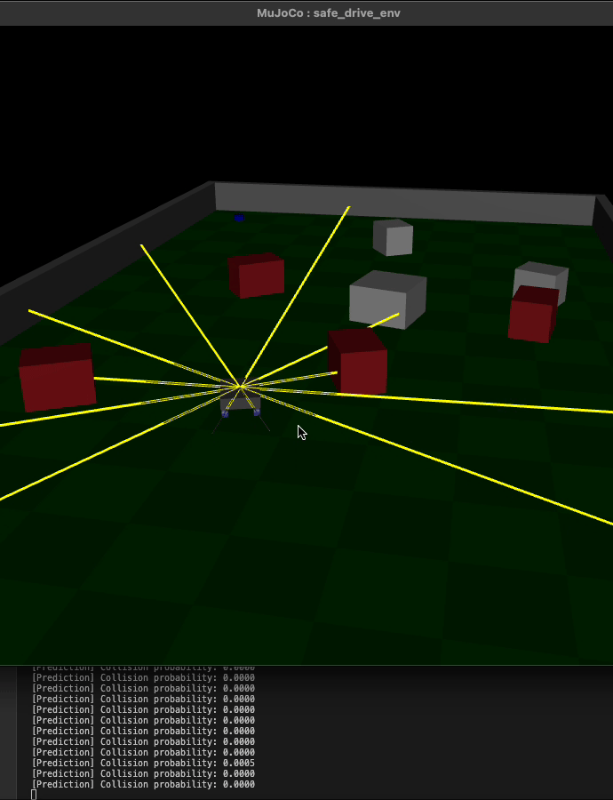
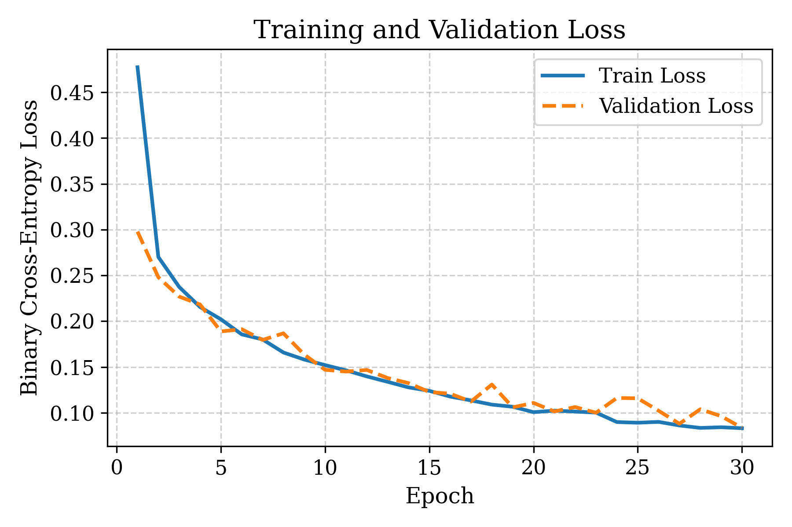
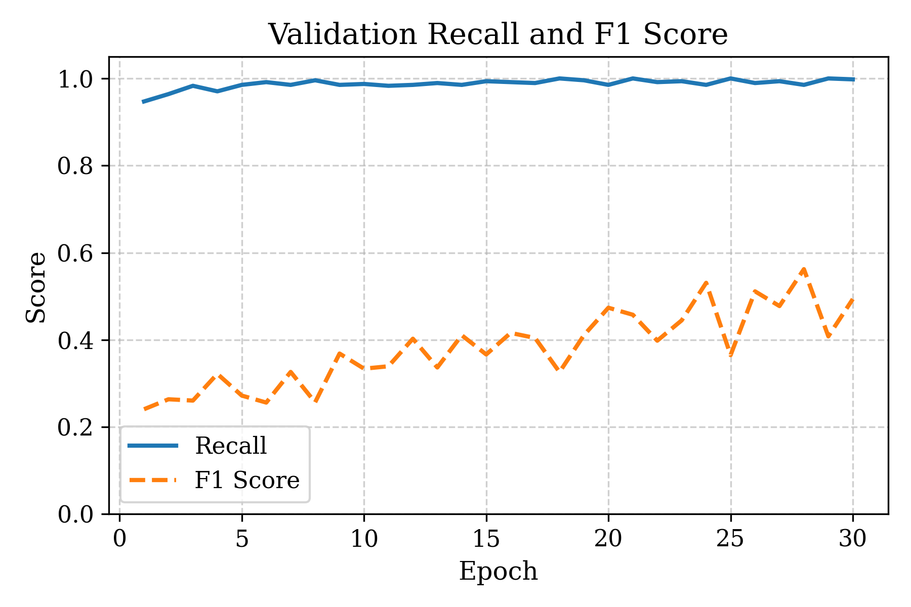

## Real-Time Collision Prediction for Autonomous Vehicles (MuJoCo + PyTorch)

This project implements the **collision probability prediction (CPP)** component of the method proposed in:

> *Safe Reinforcement Learning with Stability Guarantee for Motion Planning of Autonomous Vehicles*  
> IEEE Transactions on Neural Networks and Learning Systems (TNNLS), 2021  
> [DOI link](https://doi.org/10.1109/TNNLS.2021.3084685)

The CPP model is trained in a custom MuJoCo simulation environment. It takes range sensor data and velocity information as input and predicts the likelihood of an imminent collision. PyTorch is used for model training and inference.

---

## Demo

Below is a real-time demo of the CPP model running in the MuJoCo viewer. The model makes predictions frame by frame as the vehicle explores a cluttered environment.

---

## Training Details

A total of **272,000 labeled examples** were collected from the MuJoCo simulation using a custom data collection pipeline. Each sample contains 14 input features: 10 LiDAR-style range readings, 2D previous linear and angular velocities, 2D current linear and angular velocity.  The dataset was randomly split into:
- **Training set**: 80% (217,600 examples)
- **Validation set**: 20% (54,400 examples)

The model is trained for **up to 30 epochs** using the Adam optimizer and **early stopping** with a patience of 5 epochs based on validation loss. The neural network has the following architecture: 
- Input: 14D vector  
  → 10D rangefinder readings  
  → 2D current velocity + 2D previous velocity  
- Output: Probability of collision
- Model: 3-layer MLP with ReLU, sigmoid output
- Loss: Weighted BCE with class imbalance adjustment

---

## Training Curves

### Loss Curve

The following plot shows training and validation binary cross-entropy loss over epochs:

### Recall and F1 Score

Validation recall and F1 score over epochs:

- **Recall** reflects how consistently the model identifies dangerous states.
- **F1 Score** captures how well it balances false positives and false negatives.

### Best Results
- **Best Validation Loss**: 0.0835  
- **Best Recall**: 0.9979  
- **Best F1 Score**: 0.4935  
