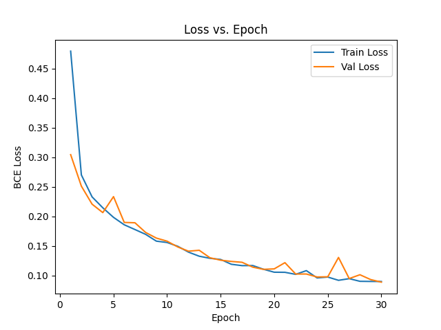
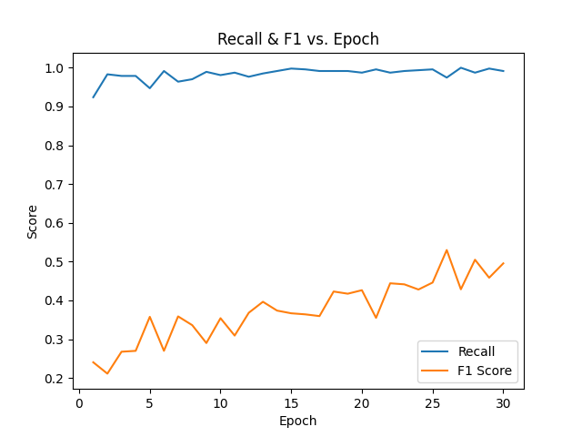

## Real-Time Collision Prediction for Autonomous Vehicles (MuJoCo + PyTorch)

This project mainly replicates the **collision probability prediction (CPP)** component from the paper:

> *Safe Reinforcement Learning with Stability Guarantee for Motion Planning of Autonomous Vehicles*  
> IEEE TNNLS, 2021 ([link](https://doi.org/10.1109/TNNLS.2021.3084685))

The CPP model is trained on a MuJoCo-based driving simulation to predict collision risk based on range sensor inputs and velocity data. PyTorch is used as the deep learning framework. 

## Demo of Collision Prediction Model

## Training Performance
The model’s learning process is monitored by plotting **loss**, **recall**, and **F1 score** on the validation set across epochs. The model is trained for up to 30 epochs with early stopping after 5 consecutive non-improving epochs on the validation loss.

### Loss Curve
Shows the binary cross-entropy loss for both training and validation datasets.
Helps verify convergence and identify overfitting.

### Recall & F1 Score
- **Recall**: Measures how well the model identifies risky states.
- **F1 Score**: Balances precision and recall to assess overall classification quality.

